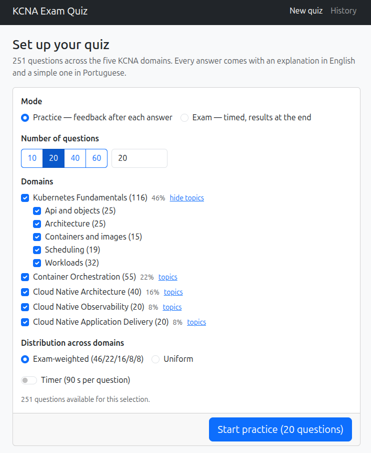
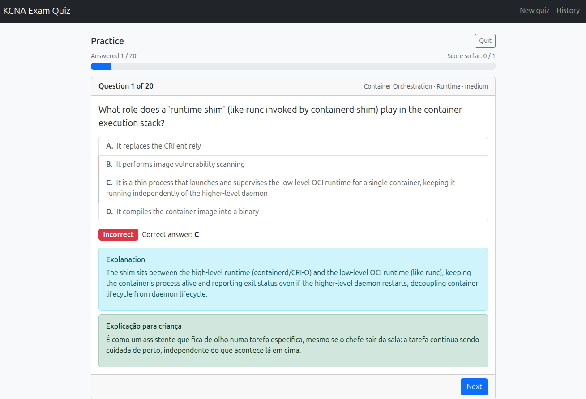

# KCNA Exam Quiz

A local, offline-first web app that simulates the Linux Foundation **KCNA** (Kubernetes and
Cloud Native Associate) exam. Practice with instant, bilingual feedback or rehearse the real
exam under timed conditions — all questions, answers and explanations live as plain Markdown
files you can read, edit and extend.

## Screenshots

|  |  |
| -------- | -------- |
|   |    |


## Highlights

- **Two modes** — Practice (confirm each answer, see right/wrong plus explanations
  immediately) and Exam (timed, no feedback until you finish, then a full review).
- **Configurable sessions** — choose the number of questions and which of the five KCNA domains
  (and topics within them) to include.
- **Every answer teaches twice** — a concise technical explanation in English, and a simple,
  analogy-based explanation in Brazilian Portuguese, shown for every question.
- **Local history and focus suggestions** — attempts are stored in your browser only; the app
  points out the topics and domains where your accuracy is weakest.
- **Content as data** — the ~250-question bank lives under [`data/questions/`](./data/questions)
  as one Markdown file per question, organized by domain and topic folders. No question text
  lives in application code.
- **Fully offline** once loaded: no backend, no network calls, no accounts.

## Quick start

```bash
docker compose up dev
```

Then open **http://localhost:5173**. See [docs/how-to-run.md](./docs/how-to-run.md) for the
production build, running without Docker, and troubleshooting.

## Extending the question bank

Adding a question is copying a Markdown file, editing it, and running one validation command —
no code changes required. See [docs/how-to-extend.md](./docs/how-to-extend.md) and the file
format spec in [docs/question-format.md](./docs/question-format.md).

## Documentation

Full docs live in [`docs/`](./docs/README.md):

- [How to run](./docs/how-to-run.md)
- [How to extend the question bank](./docs/how-to-extend.md)
- [Question file format](./docs/question-format.md)
- [KCNA domains and reference courses](./docs/kcna-domains.md)

The original feature specification and implementation plan (written with
[GitHub Spec Kit](https://github.com/github/spec-kit)) are in
[`specs/001-kcna-exam-quiz/`](./specs/001-kcna-exam-quiz/).

## Development

```bash
npm ci
npm run dev             # dev server with hot reload
npm run test:run        # full test suite (Vitest)
npm run validate:questions  # just the question-bank validation
npm run typecheck
npm run lint
```

Stack: React 18 + TypeScript, react-bootstrap/Bootstrap 5, Vite 5, Vitest +
Testing Library, Docker + Docker Compose.

## Reference material

Question content follows the official KCNA curriculum and is informed by the Linux Foundation
courses **LFS158** (Introduction to Kubernetes) and **LFS250** (Introduction to Cloud Native and
Kubernetes). This app is a practice tool, not a substitute for those courses — see
[docs/kcna-domains.md](./docs/kcna-domains.md) for the full domain-to-course mapping.

## Disclaimer

This is an independent study aid and is not affiliated with, endorsed by, or produced by the
Linux Foundation or the CNCF. KCNA, LFS158 and LFS250 are referenced solely to describe the
exam and courses this app helps learners prepare for.
